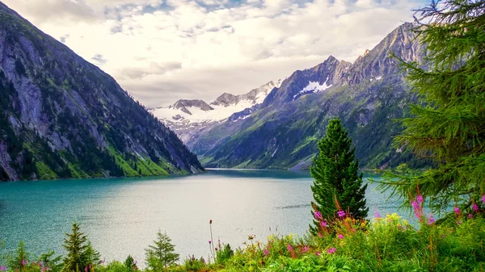

# tag_img
Imagens

Imagem salva no diretório raiz do projeto
=========================================

* * *

Imagem salva na pasta imagens
=============================

* * *

Imagem de um link externo
=========================

